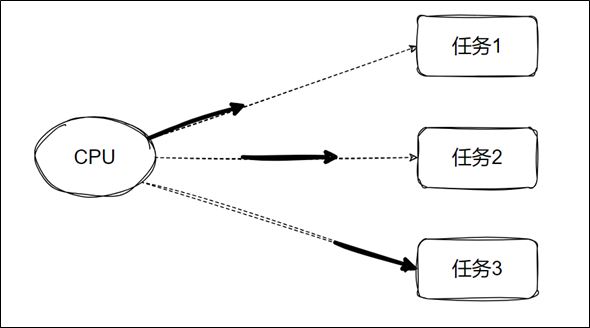
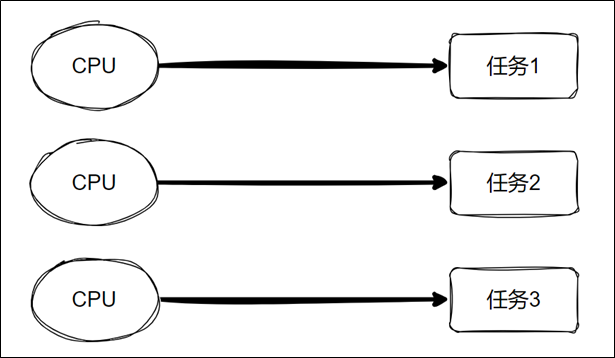

## 并发VS并行

### 并发

单个 CPU 处理多个任务。各个任务交替执行一段时间



### 并行

多个 CPU(可以是逻辑CPU) 同时执行多个任务



## 进程

### 定义

`进程`是操作系统进行`资源分配`的`基本单位`。

操作系统中一个正在运行的程序或软件就是一个进程。

每个进程都有自己独立的一块内存空间。

一个进程崩溃后，在保护模式下不会对其他进程产生影响。

多进程是指在操作系统中同时运行多个程序。

## multiprocessing.Process创建进程

### 说明

Unix/Linux操作系统提供了一个 os.fork() 系统调用，它非常特殊。普通的函数调用，调用一次，返回一次，但是 fork() 调用一次，返回两次，因为操作系统自动把当前进程（父进程）复制了一份（子进程），然后，分别在父进程和子进程内返回。

Windows 中没有 fork() 调用，不过Python提供了一个跨平台的多进程模块 multiprocessing。multiprocessing 模块提供了一个 Process 类来代表一个进程对象。

### Process 的创建

```python
multiprocessing.Process(group=None, target=None, name=None, args=(), kwargs={}, *, daemon=None)
```

1. group：应当始终为 None，它的存在仅是为了与 threading.Thread 兼容。
2. target：由 run() 方法来发起调用的可调用对象，默认为 None。
3. name：进程名称，默认为 None 则自动分配。
4. args：针对目标调用的参数元组。
5. kwargs：针对目标调用的关键字参数字典。
6. daemon：是否为守护进程，True 或 False。默认为None则继承父进程。

### Process 的属性和方法与其他常用方法

1.  name：获取进程名称。
2. pid：获取进程号。
3. daemon：判断或设置进程是否为守护进程。
4. exitcode：获取子进程的退出状态码。
5. start()：启动进程，调用传入 target 的对象。start() 只能被调用一次。
6. run()：默认调用传入 target 的对象，如果子类化了 Process，可以重写此方法来自定义行为。
7. join([timeout])：阻塞主进程，直到子进程结束或超时。timeout参数可选，意为阻塞多少秒。
8. terminate()：强制终止子进程。
9. kill()：杀死进程，与 terminate() 类似，但更彻底。
10. is_alive()：检查进程是否仍在运行。
11. os.getpid()：获取当前进程编号。
12. os.getppid()：获取当前进程的父进程编号。

### 案例：同时读写文件

注意：在Windows上执行要加上if __name__ == "__main__"。

```python
import time
import multiprocessing

# 向文件中写入数据
def write_file():
    with open("test.txt", "a") as f:
        while True:
            f.write("hello world\n")
            f.flush()
            time.sleep(0.5)

# 从文件中读取数据
def read_file():
    with open("test.txt", "r") as f:
        while True:
            time.sleep(0.1)
            print(f.read(1))

if __name__ == "__main__":
    # 创建一个子进程用于写文件
    p1 = multiprocessing.Process(target=write_file)
    # 创建一个子进程用于读文件
    p2 = multiprocessing.Process(target=read_file)
    # 启动子进程
    p1.start()
    # 启动子进程
    p2.start()
```

## 自定义Process子类创建进程

```python
import os
import multiprocessing

class Worker(multiprocessing.Process):
    def run(self):
        print("进程id：", os.getpid(), "\t父进程id：", os.getppid())

if __name__ == "__main__":
    for i in range(5):
        p = Worker()
p.start()
```

## 进程池

### 场景

当需要启动大量子进程时，可以使用进程池

### 进程池创建

```python
multiprocessing.Pool([processes[,initializer[,initargs[,maxtasksperchild[,context]]]]])
```

1. processes：要使用的工作进程数量。如果 processes 为 None 则使用 os.cpu_count() 所返回的数值。
2. initializer：如果不为 None，则每个工作进程将会在启动时调用 initializer(*initargs)。
3. maxtasksperchild：一个工作进程在它退出或被一个新的工作进程代替之前能完成的任务数量，为了释放未使用的资源。默认的 maxtasksperchild 是 None，意味着工作进程寿与池齐。
4. context：可被用于指定启动的工作进程的上下文。通常一个进程池是使用函数 multiprocessing.Pool() 或者一个上下文对象的 Pool() 方法创建的。

注意：进程池对象的方法只有创建它的进程能够调用。

使用时一般只指定 processes 参数

### 进程池的常用方法

1. apply(func[, args[, kwds]])：使用 args 参数以及 kwds 命名参数同步调用 func , 在返回结果前阻塞。另外 func 只会在一个进程池中的一个工作进程中执行。
2. apply_async(func[, args[, kwds[, callback[, error_callback]]]])：使用 args 参数以及 kwds 命名参数异步调用 func，并立即返回一个 AsyncResult 对象，不会阻塞。可以通过 callback 获取结果和通过 error_callback 处理异常。
3. close()：阻止后续任务提交到进程池，当所有任务执行完成后，工作进程会退出。
4. terminate()：不必等待未完成的任务，立即停止工作进程。当进程池对象被垃圾回收时，会立即调用 terminate()。
5. join()：阻塞主进程，等待工作进程结束。调用 join() 前必须先调用 close() 或者 terminate()。

### 案例

```python
import os
import time
import multiprocessing

# 打印10个数字,每次间隔0.5秒
def func():
    for i in range(10):
        print(os.getpid(), i)
        time.sleep(0.5)

if __name__ == "__main__":
    # 指定进程池大小
    process_num = 5
    pool = multiprocessing.Pool(process_num)
    for p in range(process_num):
        # 阻塞式
        # pool.apply(func)
        # 非阻塞式
        pool.apply_async(func)
    pool.close()
    pool.join()
    print("end")

```


## 进程间通信

### 进程间不共享全局变量

子进程向传入的列表中添加元素，最终发现主进程与子进程之间的列表结果不同

```python
import os
import multiprocessing

# 向list1中添加10个元素
def func(list1):
    for i in range(10):
        list1.append(i)
        print(os.getpid(), list1)

if __name__ == "__main__":
    list1 = []
    p1 = multiprocessing.Process(target=func, args=(list1,))
    p2 = multiprocessing.Process(target=func, args=(list1,))
    p1.start()
    p2.start()
    p1.join()
    p2.join()
    print(os.getpid(), list1)
```

### 使用 Queue 通信

Python的multiprocessing模块包装了底层的机制，提供了Queue、Pipes等多种方式来交换数据。

multiprocessing.Queue([maxsize]) 返回一个使用一个管道和少量锁和信号量实现的共享队列（先进先出）实例。当一个进程将一个对象放进队列中时，一个写入线程会启动并将对象从缓冲区写入管道中。默认队列是无限大小的，可以通过 maxsize 参数限制。

1. Queue的常用方法

1. qsize()：返回队列的大致长度。由于多线程或者多进程的上下文，这个数字是不可靠的。
2. empty()：如果队列是空的返回 True。由于多线程或多进程的环境，该状态是不可靠的。
3. full()：如果队列是满的返回 True。由于多线程或多进程的环境，该状态是不可靠的。
4. put(obj[, block[, timeout]])：将 obj 放入队列。如果可选参数 block 是 True（默认值）而且 timeout 是 None（默认值），将会阻塞当前进程，直到有空的缓冲槽。如果 timeout 是正数，将会在阻塞了最多 timeout 秒之后还是没有可用的缓冲槽时抛出 queue.Full 异常。反之（block 是 False 时），仅当有可用缓冲槽时才放入对象，否则抛出 queue.Full 异常（在这种情形下 timeout 参数会被忽略）。
5. put_nowait(obj)：相当于 put(obj, False)。
6. get([block[, timeout]])：从队列中取出并返回对象。如果可选参数 block 是 True （默认值）而且 timeout 是 None（默认值），将会阻塞当前进程，直到队列中出现可用的对象。如果 timeout 是正数，将会在阻塞了最多 timeout 秒之后还是没有可用的对象时抛出 queue.Empty 异常。反之（block 是 False 时），仅当有可用对象能够取出时返回，否则抛出 queue.Empty 异常（在这种情形下 timeout 参数会被忽略）。
7. get_nowait()：相当于 get(False)。

（1）案例：两个进程分别读写Queue

```python
import time
import random
import multiprocessing
# 间隔随机时间向queue中放入随机数
def func1(queue):
    while True:
        queue.put(random.randint(1, 50))
        time.sleep(random.random())

# 从queue中取出数据
def func2(queue):
    while True:
        print("=" * queue.get())

if __name__ == "__main__":
    queue = multiprocessing.Queue()
    p1 = multiprocessing.Process(target=func1, args=(queue,))
    p2 = multiprocessing.Process(target=func2, args=(queue,))
    p1.start()
    p2.start()
    p1.join()
p2.join()

```

注意：multiprocessing.Queue存在兼容性问题，如果要使用进程池，可以使用Mananger().Queue

### 进程池之间使用 Manager().Queue 通信

```python
import time
import random
import multiprocessing

# 间隔随机时间向queue中放入随机数
def func1(queue):
    while True:
        queue.put(random.randint(1, 50))
        time.sleep(random.random())

# 从queue中取出数据
def func2(queue):
    while True:
        print("=" * queue.get())
if __name__ == "__main__":
    queue = multiprocessing.Manager().Queue()
    pool = multiprocessing.Pool(2)
    pool.apply_async(func1, (queue,))
    pool.apply_async(func2, (queue,))
    pool.close()
    pool.join()

```


