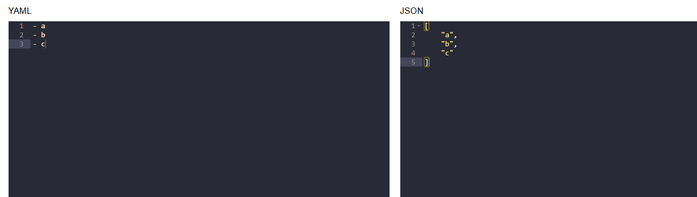
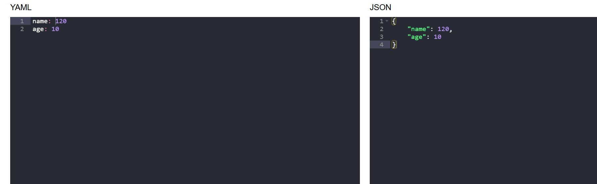
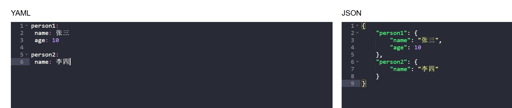
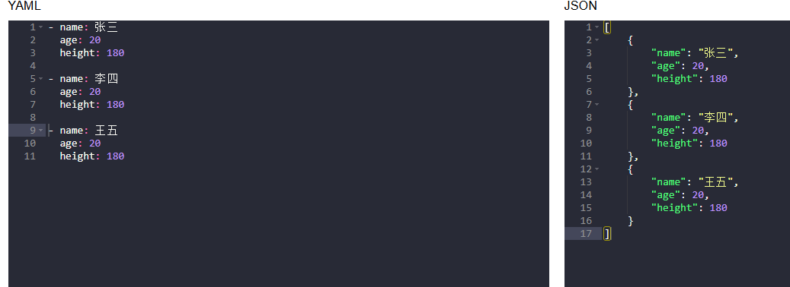

## 格式说明

### 说明

1. yaml在冒号后，一定要有空格
2. yaml以缩进来表明所属关系

### 数组

1. 使用`- 空格 -名称`定义数组



### 对象

1. 使用`key   value`的形式定义
2. 如果是嵌套，可以使用缩进实现





### 对象数组

1. 使用`-`定义数组

2. 然后使用缩进，表明所属关系

   

### 更多示例

```yaml
---
# Collection Types #############################################################
################################################################################

# http://yaml.org/type/map.html -----------------------------------------------#

map:
  # Unordered set of key: value pairs.
  Block style: !!map
    Clark : Evans
    Ingy  : dot Net
    Oren  : Ben-Kiki
  Flow style: !!map { Clark: Evans, Ingy: dot Net, Oren: Ben-Kiki }

# http://yaml.org/type/omap.html ----------------------------------------------#

omap:
  # Explicitly typed ordered map (dictionary).
  Bestiary: !!omap
    - aardvark: African pig-like ant eater. Ugly.
    - anteater: South-American ant eater. Two species.
    - anaconda: South-American constrictor snake. Scaly.
    # Etc.
  # Flow style
  Numbers: !!omap [ one: 1, two: 2, three : 3 ]

# http://yaml.org/type/pairs.html ---------------------------------------------#

pairs:
  # Explicitly typed pairs.
  Block tasks: !!pairs
    - meeting: with team.
    - meeting: with boss.
    - break: lunch.
    - meeting: with client.
  Flow tasks: !!pairs [ meeting: with team, meeting: with boss ]

# http://yaml.org/type/set.html -----------------------------------------------#

set:
  # Explicitly typed set.
  baseball players: !!set
    ? Mark McGwire
    ? Sammy Sosa
    ? Ken Griffey
  # Flow style
  baseball teams: !!set { Boston Red Sox, Detroit Tigers, New York Yankees }

# http://yaml.org/type/seq.html -----------------------------------------------#

seq:
  # Ordered sequence of nodes
  Block style: !!seq
  - Mercury   # Rotates - no light/dark sides.
  - Venus     # Deadliest. Aptly named.
  - Earth     # Mostly dirt.
  - Mars      # Seems empty.
  - Jupiter   # The king.
  - Saturn    # Pretty.
  - Uranus    # Where the sun hardly shines.
  - Neptune   # Boring. No rings.
  - Pluto     # You call this a planet?
  Flow style: !!seq [ Mercury, Venus, Earth, Mars,      # Rocks
                      Jupiter, Saturn, Uranus, Neptune, # Gas
                      Pluto ]                           # Overrated


# Scalar Types #################################################################
################################################################################

# http://yaml.org/type/bool.html ----------------------------------------------#

bool:
  - true
  - True
  - TRUE
  - false
  - False
  - FALSE

# http://yaml.org/type/float.html ---------------------------------------------#

float:
  canonical: 6.8523015e+5
  exponentioal: 685.230_15e+03
  fixed: 685_230.15
  negative infinity: -.inf
  not a number: .NaN

# http://yaml.org/type/int.html -----------------------------------------------#

int:
  canonical: 685230
  decimal: +685_230
  octal: 0o2472256
  hexadecimal: 0x_0A_74_AE
  binary: 0b1010_0111_0100_1010_1110

# http://yaml.org/type/merge.html ---------------------------------------------#

merge:
  - &CENTER { x: 1, y: 2 }
  - &LEFT { x: 0, y: 2 }
  - &BIG { r: 10 }
  - &SMALL { r: 1 }

  # All the following maps are equal:

  - # Explicit keys
    x: 1
    y: 2
    r: 10
    label: nothing

  - # Merge one map
    << : *CENTER
    r: 10
    label: center

  - # Merge multiple maps
    << : [ *CENTER, *BIG ]
    label: center/big

  - # Override
    << : [ *BIG, *LEFT, *SMALL ]
    x: 1
    label: big/left/small

# http://yaml.org/type/null.html ----------------------------------------------#

null:
  # This mapping has four keys,
  # one has a value.
  empty:
  canonical: ~
  english: null
  ~: null key
  # This sequence has five
  # entries, two have values.
  sparse:
    - ~
    - 2nd entry
    -
    - 4th entry
    - Null

# http://yaml.org/type/str.html -----------------------------------------------#

string: abcd

# http://yaml.org/type/timestamp.html -----------------------------------------#

timestamp:
  canonical:        2001-12-15T02:59:43.1Z
  valid iso8601:    2001-12-14t21:59:43.10-05:00
  space separated:  2001-12-14 21:59:43.10 -5
  no time zone (Z): 2001-12-15 2:59:43.10
  date (00:00:00Z): 2002-12-14
```


## 读取说明

### 使用omegaconf进行读取

1. 安装omegaconf

   ```bash
   uv add omegaconf
   ```

2. 引入并读取

   1. 由于Python在读取相对路径时，使用的是当前程序所在的文件夹
      因此当前文件夹如果和开发时不一致，相对路径就会出错
      所以使用绝对路径引入目录，通过`Path(__file__)`获取绝对路径

      - 使用`parent`可以一级一级跳
      - 使用`parents`可以跳多级

   2. ```python
      from pathlib import Path
      from omegaconf import OmegaConf
      config_file = Path(__file__).parents[2]/'conf'/'app_config.yaml
      
      conf = OmegaConf.load(config_file)
      print(type(conf))
      print(conf['name'])
      ```


### 带类型的索取

使用`.变量名`的方式获取

1. 使用`load`加载yaml文件
2. 使用`structured` + `@dateaclass`定义结构类
3. 使用`merge`将类和数据合并
4. 使用`to_object`将合并结果转换成对象
5. 后面使用`.`方式获取属性

```python
from dataclasses import dataclass
from pathlib import Path
from omegaconf import OmegaConf

@dataclass
class Address:
    city: str
    street: str

@dataclass 
class AppConfig:
    name: str
    age: int
    height:float
    address: Address
    
config_file = Path(_ file__).parents[2]/'conf'/ 'app_config.yaml
#定义数据
content = OmegaConf.load(config_file)
# 定义属性类
schema =OmegaConf.structured(AppConfig)
# 将属性类和数据合并
mergeResult = Omegaconf.merge( schema, content)

app_conf: Appconfig = OmegaConf.to_object(mergeResult)

# 获取变量名
print(app_conf.name)
```

