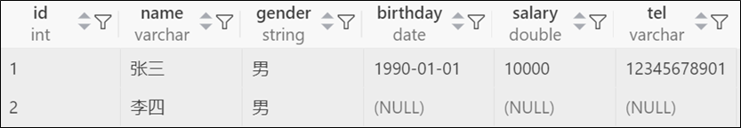
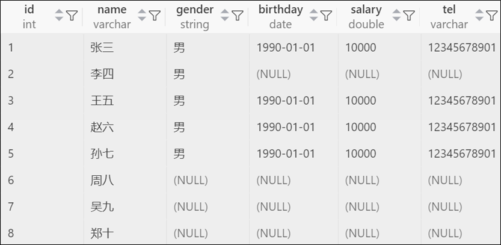

## 添加

### 只写表名

1. 值列表需与表结构对应

   1. ```sql
      insert into 表名 values(值列表),(值列表),(值列表); -- 值列表中的值的顺序、类型、个数必须与表结构一一对应
      ```

### 表名+字段

1. 值列表需与字段列表对应

   1. ```sql
      insert into 表名(字段列表) values(值列表),(值列表),(值列表); -- 值列表中的值的顺序、类型、个数必须与字段列表一一对应
      ```

### 示例

#### 插入单条数据

```sql
create database if not exists atguigu;
use atguigu;
drop table if exists teacher;
create table teacher(
    id int,
    name varchar(20),
    gender enum('男','女'),
    birthday date,
    salary double,
    tel varchar(11)
);
-- 插入一条数据
insert into teacher values(1,'张三','男','1990-01-01',10000,'12345678901');
insert into teacher(id,name,gender) values(2,'李四','男');
select * from teacher;
```



#### 插入多条数据

```sql
-- 插入多条数据
insert into teacher values
(3,'王五','男','1990-01-01',10000,'12345678901'),
(4,'赵六','男','1990-01-01',10000,'12345678901'),
(5,'孙七','男','1990-01-01',10000,'12345678901');
insert into teacher(id,name) values(6,'周八'),(7,'吴九'),(8,'郑十');
select * from teacher;
```



## 删除

### 删除多条数据

```sql
delete from 表名 where 条件;
```

### 删除表中所有数据

1. 表结构会被保留下来

   1. ```sql
      delete from 表名;
      ```

### 截断表

#### truncate使用

1. 表结构会被保留下来

   1. ```sql
      truncate 表名;
      ```

2. truncate表和delete表的区别

   - delete是一条一条删除记录的。如果在事务中，事务提交之前支持回滚
   - truncate是把整个表drop，新建一张，效率更高。就算在事务中，也无法回滚

### 示例

```sql
-- 删除姓名为郑十的记录
delete from teacher where name="郑十"; 
select * from teacher;
-- 删除所有记录
delete from teacher;
-- 截断表
truncate teacher;
```

## 修改

### 修改部分行数据

```sql
update 表名 set 字段名 = 值, 字段名 = 值 where 条件; -- 修改满足条件的行
```

### 修改所有行数据

```sql
update 表名 set 字段名 = 值, 字段名 = 值; -- 修改所有行
```

### 示例

```sql
-- 修改周八的信息
update teacher set gender="男",birthday="1960-01-01",salary=100000,tel="12332132131" where name="周八";
-- 修改所有人的薪资
update teacher set salary=salary+10000;
```

## 查询

### select语句

#### 说明

select语句是用于查看计算结果、或者查看从数据表中筛选出的数据的。

#### 基本语法

1. 语法

   1. ```sql
      select 常量;
      select 表达式;
      select 函数;
      ```

2. 示例

   1. ```sql
      select 1;
      select 9/2;
      select now();
      ```

#### select....from

1. 如果要从数据表中筛选数据，需要加from子句。from指定数据来源。字段列表筛选列

   1. ```sql
      select 字段列表 from 表名；
      ```

#### select....from....where

1. 如果要从数据表中根据条件筛选数据，需要加from和where子句。where筛选行

   1. ```sql
      select 字段列表 from 表名 where 条件;
      ```

### 使用别名

#### 说明

1. 语法

   1. ```sql
      select 字段名1 as "别名1", 字段名2 as "别名2" from 表名 as 表别名;
      ```

2. 说明

   1. 列的别名有空格时需要加双引号。列的别名中没有空格时双引号可以不加
   2. 表的别名不能加双引号，表的别名中间不能包含空格
   3. as大小写都可以，as也完全可以省略

3. 示例

   1. ```sql
      select id as 编号,name "姓 名" from teacher;
      ```

### (distinct)结果去重

1. mysql可以在查询结果中使用distinct关键字去重。

   1. ```sql
      select distinct 字段列表 from 表名;
      ```


