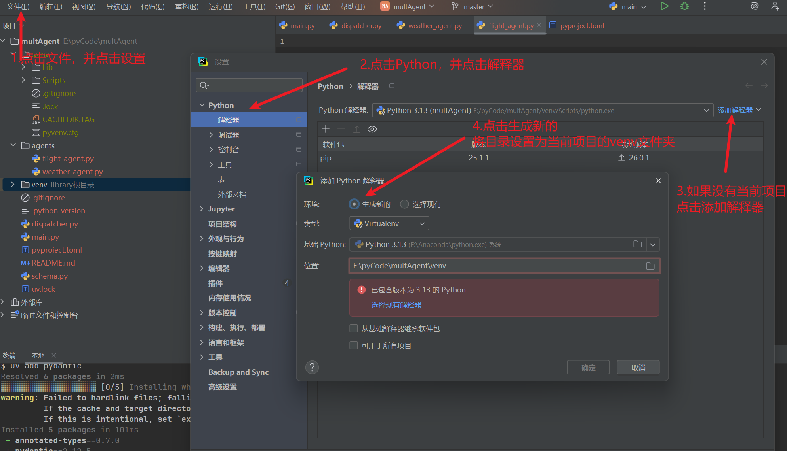

## 安装

### 创建虚拟环境，并安装

创建并激活一个 [虚拟环境](https://fastapi.tiangolo.com/zh/virtual-environments/)，来隔离你为每个工程安装的包

1. 初始化项目

   ```bash
   uv init
   ```

2. 创建虚拟环境

   ```bash
   uv venv
   ```

3. 激活虚拟环境

   ```bash
   source .venv/bin/activate
   ```

4. 更改项目解释器

   有时在pycharm会自动选择其他编译器，造成无法import模块，可以将解释器，修改为当前的.venv目录

   1. 点击设置 -> 找到Python 模块下的解释器  ->   点击添加解释器  -> 选择添加本地解释器

   2. 如果没有当前的虚拟环境选项，选择生成新的

   3. 将位置设置为当前项目的venv目录下

      

### 安装fastapi

最好安装uv, 否则只能使用pip install了

1. 包含`standard`

   ```python
   uv add "fastapi[standard]"
   ```

2. 不包含`standard`

   ```python
   uv add  "fastapi"
   ```

3. 不包含 `fastapi-cloud-cli`

   ```python
   uv add "fastapi[standard-no-fastapi-cloud-cli]"
   ```

### 最小demo

```python
from fastapi import FastAPI

app = FastAPI()

@app.get("/")
async def root():
    return {"message": "Hello World"}

@app.get("/hello/{name}")
async def say_hello(name: str):
    return {"message": f"Hello {name}"}
```

### 启动服务

#### 命令行直接启动

1. 启动服务：`uvicorn main:app --reload`
   1. main 是主入口的文件名
   2. app是使用fastAPI实例化对象的名称
   3. --reload 表示在代码修改时进行更新重启

#### 通过main启动

1. 在main方法中，写如下代码

   ```python
   if __name__ == "__main__":
       import uvicorn
   
       uvicorn.run("main:app", host="0.0.0.0", port=7860)
   ```

2. 然后运行main方法即可

### 访问文档

- `http://localhost:8000` - 查看API响应
- `http://localhost:8000/docs` - 自动生成的Swagger文档

## 路由、参数

### 路径操作与路由

#### 什么是路由

路由是URL地址和处理函数之间的映射关系

#### HTTP方法分类

1. `@app.get()`, 
2. `@app.post()`, 
3. `@app.put()`, 
4. `@app.delete()`, 
5. `@app.patch()`

### 参数类型

1. 从fastapi中导入FastApi，使用FastAPI进行实例化

   1. ```python
      from fastapi import FastApi, APIRouter
      app = FastAPI()
      
      router = APIRouter() #使用路由模块
      ```

2. 注意
   1. 同一个端点不能同时接收`Body`和`Form`
   2. `Form`默认是`application/x-www-form-urlencoded`
   3. 文件上传需要使用`File`而不是`Form`

| 参数类型 | 来源          | 示例                         | 从fastapi解构的包 |
| :------- | :------------ | :--------------------------- | ----------------- |
| 路径参数 | URL路径       | `/items/{item_id}`           | Path              |
| 查询参数 | URL?key=value | `/items?skip=0&limit=10`     | Query             |
| 请求体   | JSON Body     | POST/PUT请求的JSON数据       | Body              |
| 表单数据 | Form Data     | `from fastapi import Form`   | Form              |
| 请求头   | Headers       | `from fastapi import Header` | Header            |

#### 路径参数

1. 使用fastapi的Path功能

##### 单参数

```python
from fastapi import Path,FastAPI
from typing import Optional
app = FastAPI(
    title="FastAPI 参数类型示例",
    description="演示路径参数、查询参数、请求体、表单数据、请求头的使用",
    version="1.0.0"
)
@app.get("/items/{item_id}")
async def read_item(
    item_id: int = Path(..., description="物品ID", ge=1, le=1000),
    q: Optional[str] = None  # 还可以混合查询参数
):
    """
    演示路径参数的使用
    
    - **item_id**: 路径中的物品ID（自动转换为整数）
    - **q**: 可选的查询参数
    """
    return {
        "parameter_type": "路径参数",
        "item_id": item_id,
        "item_id_type": type(item_id).__name__,
        "query_param": q,
        "message": f"获取了ID为 {item_id} 的物品"
    }
```

##### 多参数

```python
# 支持多种路径参数类型
@app.get("/users/{username}/posts/{post_id}")
async def read_user_post(
    username: str = Path(..., description="用户名", min_length=3),
    post_id: int = Path(..., description="文章ID", ge=1)
):
    """
    演示多个路径参数
    
    - **username**: 用户名（字符串类型）
    - **post_id**: 文章ID（整数类型）
    """
    return {
        "parameter_type": "路径参数（多个）",
        "username": username,
        "post_id": post_id,
        "message": f"用户 {username} 的第 {post_id} 篇文章"
    }

```

#### 查询参数

##### 基本使用

```python
@app.get("/search")
async def search_items(
    q: str = Query(..., description="搜索关键词", min_length=1, max_length=50),
    page: int = Query(1, description="页码", ge=1),
    size: int = Query(10, description="每页数量", ge=1, le=100),
    sort_by: Optional[str] = Query("id", description="排序字段"),
    order: str = Query("asc", description="排序顺序", regex="^(asc|desc)$")
):
    """
    演示查询参数的使用
    
    URL示例: /search?q=python&page=2&size=20&sort_by=price&order=desc
    """
    # 计算偏移量
    offset = (page - 1) * size
    
    return {
        "parameter_type": "查询参数",
        "query_params": {
            "keyword": q,
            "page": page,
            "size": size,
            "offset": offset,
            "sort_by": sort_by,
            "order": order
        },
        "message": f"搜索关键词 '{q}'，返回第 {page} 页，共 {size} 条数据"
    }
```

##### 带默认值

```python
@app.get("/products")
async def list_products(
    category: Optional[str] = Query(None, description="商品分类"),
    min_price: float = Query(0.0, description="最低价格", ge=0),
    max_price: float = Query(10000.0, description="最高价格", ge=0),
    in_stock: bool = Query(True, description="是否有货")
):
    """
    演示带默认值的查询参数
    
    URL示例: /products?category=电子&min_price=100&max_price=5000&in_stock=true
    """
    return {
        "parameter_type": "查询参数（带默认值）",
        "filters": {
            "category": category,
            "price_range": [min_price, max_price],
            "in_stock": in_stock
        }
    }
```

#### 请求体

##### 基本使用

```python
@app.post("/users")
async def create_user(
    user: UserInfo = Body(..., description="用户信息"),
    # 也可以混合查询参数
    admin_token: Optional[str] = Query(None, description="管理员token")
):
    """
    演示请求体的使用（JSON Body）
    
    请求体示例:
    {
        "username": "张三",
        "age": 25,
        "email": "zhangsan@example.com",
        "tags": ["developer", "python"]
    }
    """
    return {
        "parameter_type": "请求体",
        "user_info": user.model_dump(),
        "admin_token": admin_token,
        "message": f"成功创建用户: {user.username}"
    }
```

##### 复杂请求体

```python
# 复杂请求体示例（嵌套模型）
class Address(BaseModel):
    city: str
    street: str
    zip_code: str

class UserWithAddress(BaseModel):
    user_info: UserInfo
    address: Address
    preferences: Optional[dict] = None

@app.post("/users/detailed")
async def create_user_detailed(
    user_data: UserWithAddress = Body(..., description="完整的用户信息")
):
    """
    演示复杂的嵌套请求体
    """
    return {
        "parameter_type": "请求体（嵌套）",
        "received_data": user_data.model_dump(),
        "message": f"创建了用户 {user_data.user_info.username}，地址: {user_data.address.city}"
    }
```

#### 表单数据

##### 基础使用

```python
@app.post("/login")
async def login(
    username: str = Form(..., description="用户名", min_length=3),
    password: str = Form(..., description="密码", min_length=6),
    remember_me: bool = Form(False, description="记住我")
):
    """
    演示表单数据的接收（Form Data）
    
    注意: 表单数据通常用于application/x-www-form-urlencoded或multipart/form-data
    测试时可以使用Postman或curl:
    curl -X POST http://localhost:8000/login \
         -F "username=张三" \
         -F "password=123456" \
         -F "remember_me=true"
    """
    # 实际应用中应该验证密码
    return {
        "parameter_type": "表单数据",
        "username": username,
        "password_length": len(password),
        "remember_me": remember_me,
        "message": f"用户 {username} 登录{'成功' if remember_me else '成功'}"
    }
```

##### 多个字段的表单数据

```python
@app.post("/upload")
async def upload_file(
    title: str = Form(..., description="文件标题"),
    description: Optional[str] = Form(None, description="文件描述"),
    # 注意: 文件上传需要使用 File，这里仅演示表单字段
    tags: str = Form("", description="标签，多个用逗号分隔")
):
    """
    演示包含多个字段的表单数据
    """
    tag_list = [tag.strip() for tag in tags.split(",") if tag.strip()]
    
    return {
        "parameter_type": "表单数据（多字段）",
        "title": title,
        "description": description,
        "tags": tag_list,
        "message": f"上传文件信息: {title}"
    }
```

#### 请求头

##### 基础使用

```python
@app.get("/protected")
async def read_protected_data(
    authorization: str = Header(..., description="认证token", alias="Authorization"),
    user_agent: Optional[str] = Header(None, description="用户代理"),
    x_request_id: Optional[str] = Header(None, description="请求ID", alias="X-Request-ID"),
    accept_language: str = Header("zh-CN", description="语言偏好")
):
    """
    演示请求头的使用
    
    客户端需要设置请求头:
    Authorization: Bearer your-token-here
    X-Request-ID: 12345
    User-Agent: Mozilla/5.0
    Accept-Language: en-US
    """
    # 验证token（简单示例）
    if not authorization.startswith("Bearer "):
        return {
            "error": "Invalid authorization header format",
            "expected": "Bearer <token>"
        }
    
    token = authorization.replace("Bearer ", "")
    
    return {
        "parameter_type": "请求头",
        "headers_received": {
            "authorization": "Bearer *****",  # 隐藏实际token
            "token_valid": bool(token),
            "user_agent": user_agent,
            "request_id": x_request_id,
            "accept_language": accept_language
        },
        "message": "访问受保护资源成功" if token else "认证失败"
    }
```

##### 获取所有请求头

```python
from fastapi import Request

@app.get("/headers-info")
async def get_all_headers(request: Request):
    """
    演示如何获取所有请求头
    """
    headers = dict(request.headers)
    return {
        "all_headers": headers,
        "host": headers.get("host"),
        "user_agent": headers.get("user-agent")
    }
```

#### 同时使用多个参数类型

```python
@app.post("/items/{item_id}")
async def create_item(
    # 路径参数
    item_id: int = Path(..., description="物品ID", ge=1),
    
    # 查询参数
    category: str = Query(..., description="物品分类"),
    
    # 请求体
    item_data: dict = Body(..., description="物品数据"),
    
    # 表单数据（注意：不能与请求体同时使用，这里仅作演示）
    # 表单数据和请求体会冲突，所以这里注释掉
    # admin_note: str = Form(None, description="管理员备注"),
    
    # 请求头
    authorization: str = Header(..., description="认证token")
):
    """
    演示同时使用多种参数类型（路径+查询+请求体+请求头）
    
    注意: 表单数据和请求体不能同时使用，因为Content-Type不同
    """
    return {
        "path_param": {"item_id": item_id},
        "query_param": {"category": category},
        "body_param": item_data,
        "header_param": {"authorization": authorization[:20] + "..." if authorization else None},
        "message": f"成功创建物品 {item_id}，分类: {category}"
    }
```

#### 启动应用

```python
if __name__ == "__main__":
    uvicorn.run(
        app, 
        host="127.0.0.1", 
        port=8000,
        reload=True
    )
```

### 路由模块化

1. 生成前缀，实现路由模块化

   ```python
   # routers/users.py
   from fastapi import APIRouter
   
   router = APIRouter(prefix="/users", tags=["用户管理"])
   
   @router.get("/{user_id}")
   async def get_user(user_id: int):
       return {"user_id": user_id}
   
   # main.py
   from routers import users
   app.include_router(users.router)
   ```

#### Pydantic 的使用

1. 具体的，在Python 笔记中的，第三方库模块，有关于Pydantic的使用


