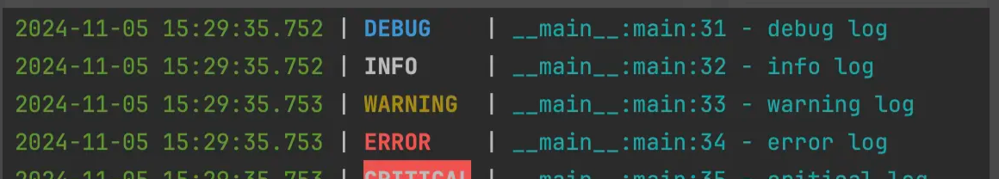

## 安装依赖

```bash
pip install loguru
```

## 简单示例

loguru有7个日志等级，依次是trace、debug、info、success，warning、error、critical，严重程度逐级上升

`level的值，从debug开始，以10递增，特有的success为25`

1. `trace`(5): 最详细的追踪信息，通常用于开发调试
2. `debug`(10)：调试信息
3. `info`(20)：常规信息
4. `success`(25)：成功操作（Loguru 特有的级别）
5. `warning`(30)：警告
6. `error`(40)：错误信息
7. `critical`(50)：严重错误

```python
from loguru import logger

logger.info("info msg")
logger.warning("warning msg")
logger.error("error msg")
logger.critical("critical msg")
```

## 添加日志到文件

### 代码

```python
import sys

from loguru import logger


def main():
    # 自定义日志格式，指定 level 宽度为 8
    log_format = "{time:YYYY-MM-DD HH:mm:ss.SSS} | {level:<8} | {name}:{function}:{line} - {message}"

    # 文件输出
    logger.add(
        sink="logs/log_{time}.log",
        format=log_format,
        rotation="1 day",
        retention="7 days",
        level="INFO",
    )
    logger.debug("debug log")
    logger.info("info log")
    logger.warning("warning log")
    logger.error("error log")
    logger.critical("critical log")


if __name__ == '__main__':
    main()

```

### 参数说明

**logger.add** 方法常用配置参数说明

- **sink**：日志输出的目标，可以是文件路径（字符串）、`sys.stdout`（控制台）、`sys.stderr`等。
- **level**：设置日志的最低等级，只有大于等于该等级的日志才会输出。支持的日志等级包括 `TRACE`、`DEBUG`、`INFO`、`WARNING`、`ERROR`、`CRITICAL`。
- **format**：日志的输出格式，支持通过 `{}` 占位符指定内容，如 `{time}`、`{level}`、`{message}` 等。可以通过指定宽度和对齐方式来控制字段的显示格式。
- **rotation**：日志轮转条件，可以是以下之一：
  - **时间间隔**：如 `"1 day"` 表示每日轮转，`"1 week"` 表示每周轮转。
  - **文件大小**：如 `"500 MB"` 表示当日志文件超过 500MB 时自动轮转。
  - **自定义函数**：自定义判断条件函数，每次写入前都会执行此函数来决定是否轮转。
- **retention**：日志保留策略，用于自动清理旧日志文件。可以是时间间隔（如 `"7 days"`）或自定义函数，满足条件的日志文件会被删除。
- **enqueue**：布尔值，`True` 表示使用队列在单独线程中异步写入日志，适合多线程或多进程环境，避免竞争条件。
- **serialize**：布尔值，`True` 表示将日志序列化为 JSON 格式，便于结构化存储和分析。适用于 JSON 日志分析工具。
- **backtrace**：布尔值，`True` 时在异常日志中显示完整回溯信息，包括导致错误的初始位置，适用于调试复杂错误。
- **diagnose**：布尔值，`True` 时会在异常回溯中显示更多调试信息，比如局部变量值。一般在开发和调试阶段启用。
- **catch**：布尔值，`True` 时会捕获和记录 `sink` 中的任何异常，而不会中断应用程序。
- **filter**：可以是字典或函数，用于过滤日志输出。可以针对特定模块或函数设置不同的日志策略。例如：`filter={"module_name": "INFO"}` 表示该模块只记录 `INFO` 及以上级别的日志。
- **colorize**：布尔值，`True` 时在控制台启用彩色日志输出（仅适用于控制台输出），帮助快速区分日志等级。

## 控制台标准输出

```python
import sys

from loguru import logger


def main():
    # 自定义日志格式，指定 level 宽度为 8，日志颜色等
    log_format = ("<green>{time:YYYY-MM-DD HH:mm:ss.SSS}</green> | "
                  "<level>{level:<8}</level> | "
                  "<cyan>{name}:{function}:{line} - {message}</cyan>")

    logger.remove()  # 移除默认的日志处理器

    # 控制台标准输出
    logger.add(sink=sys.stdout, format=log_format, level="DEBUG", colorize=True)

    logger.debug("debug log")
    logger.info("info log")
    logger.warning("warning log")
    logger.error("error log")
    logger.critical("critical log")


if __name__ == '__main__':
    main()

```



## 基于 loguru 小封装

### 一些配置

通常有些日志配置在项目开发中是固定的，故可以准备一些默认的日志配置，如下是具体的封装代码

```python
#!/usr/bin/python3
# -*- coding: utf-8 -*-
# @Author: Hui
# @File: base.py
# @Desc: { 日志配置相关函数 }
# @Date: 2024/08/12 11:12
import logging
from pathlib import Path
from typing import Type, Union

from py_tools.logging import logger
from py_tools.logging.default_logging_conf import (
    default_logging_conf,
    server_logging_retention,
    server_logging_rotation,
)
from py_tools.utils.func_util import add_param_if_true


def setup_logging(
    log_dir: Union[str, Path] = None,
    *,
    log_conf: dict = None,
    sink: Union[str, Path] = None,
    log_level: Union[str, int] = None,
    console_log_level: Union[str, int] = logging.DEBUG,
    log_format: str = None,
    log_filter: Type[callable] = None,
    log_rotation: str = server_logging_rotation,
    log_retention: str = server_logging_retention,
    **kwargs,
):
    """
    配置项目日志信息
    Args:
        log_dir (Union[str, Path]): 日志存储的目录路径。
        log_conf (dict): 项目的详细日志配置字典，可覆盖其他参数的设置。
        sink (Union[str, Path]): 日志文件sink
        log_level (Union[str, int]): 全局的日志级别，如 'DEBUG', 'INFO', 'WARNING', 'ERROR', 'CRITICAL' 或对应的整数级别。
        console_log_level (Union[str, int]): 控制台输出的日志级别，默认为 logging.DEBUG。
        log_format (str): 日志的格式字符串。
        log_filter (object): 用于过滤日志的可调用对象。
        log_rotation (str): 日志的轮转策略，例如按时间或大小轮转， 默认每天 0 点新创建一个 log 文件。
        log_retention (str): 日志的保留策略，指定保留的时间或数量，默认最长保留 7 天。
        **kwargs: 其他未明确指定的额外参数，用于未来的扩展或备用。

    Returns:
        None
    """
    logger.remove()
    logging_conf = {**default_logging_conf}
    logging_conf["console_handler"]["level"] = console_log_level

    log_conf = log_conf or {}
    log_conf.update(**kwargs)

    conf_mappings = {
        "sink": sink,
        "level": log_level,
        "format": log_format,
        "rotation": log_rotation,
        "retention": log_retention,
    }
    for key, val in conf_mappings.items():
        add_param_if_true(log_conf, key, val)

    if log_dir:
        log_dir = Path(log_dir)
        server_log_file = log_dir / "server.log"
        error_log_file = log_dir / "error.log"
        log_conf["sink"] = log_conf.get("sink") or server_log_file
        logging_conf["error_handler"]["sink"] = error_log_file
    else:
        if not log_conf.get("sink"):
            raise ValueError("log_conf must have `sink` key")

        sink_file = log_conf.get("sink")
        sink_file = Path(sink_file)
        error_log_file = sink_file.parent / "error.log"
        logging_conf["error_handler"]["sink"] = error_log_file

    add_param_if_true(logging_conf, "server_handler", log_conf)
    for log_handler, _log_conf in logging_conf.items():
        _log_conf["filter"] = log_filter
        logger.add(**_log_conf)

    logger.info("setup logging success")

```

### 默认配置如下

```python
# 项目日志目录
logging_dir = BASE_DIR / "logs"

# 项目运行时所有的日志文件
server_log_file = logging_dir / "server.log"

# 错误时的日志文件
error_log_file = logging_dir / "error.log"

# 项目服务综合日志滚动配置（每天 0 点新创建一个 log 文件）
# 错误日志 超过10 MB就自动新建文件扩充
server_logging_rotation = "00:00"
error_logging_rotation = "10 MB"

# 服务综合日志文件最长保留 7 天，错误日志 30 天
server_logging_retention = "7 days"
error_logging_retention = "30 days"

# 项目日志配置
console_log_level = logging.DEBUG
trace_msg_log_format = "{time:YYYY-MM-DD HH:mm:ss.SSS} | {level:<8} | {trace_msg} | {name}:{function}:{line} - {message}"
default_log_format = "{time:YYYY-MM-DD HH:mm:ss.SSS} | {level:<8} | {name}:{function}:{line} - {message}"
console_log_format = ("<green>{time:YYYY-MM-DD HH:mm:ss.SSS}</green> | "
                      "<level>{level:<8}</level> | "
                      "<level>{name}:{function}:{line} - {message}</level>")
                      
default_logging_conf = {
    "console_handler": {
        "sink": sys.stdout,
        "level": console_log_level,
    },
    "server_handler": {
        "sink": server_log_file,
        "level": "INFO",
        "rotation": server_logging_rotation,
        "retention": server_logging_retention,
        "enqueue": True,
        "backtrace": False,
        "diagnose": False,
    },
    "error_handler": {
        "sink": error_log_file,
        "level": "ERROR",
        "rotation": error_logging_rotation,
        "retention": error_logging_retention,
        "enqueue": True,
        "backtrace": True,
        "diagnose": True,
    },
}

```

这里设置了三个日志输出sink，分别是

- 控制台：日志等级 `debug` 及以上
- 服务日志文件：日志等级 `INFO` 及以上
  - 日志文件最长保留 7 天
  - 每天 0 点新创建一个 log 文件
- 服务错误日志：日志等级 `Error` 及以上
  - 日志文件最长保留 30 天
  - 超过10 MB就自动新建文件扩充

函数 `setup_logging` 的参数主要是控制服务日志，其他两个都是用默认的配置就够了，再项目中配置日志就不用写一大堆的日志配置代码，而是简单提供日志目录就可以使用默认的日志配置，默认的配置不满足需求的话，也可以通过参数进行改变。如下是具体的使用

```python
#!/usr/bin/python3
# -*- coding: utf-8 -*-
# @Author: Hui
# @File: logging_demo.py
# @Desc: { 日志使用案例 }
# @Date: 2024/08/12 14:53
import logging

from py_tools.constants import BASE_DIR
from py_tools.logging import logger, setup_logging
from py_tools.logging.default_logging_conf import default_logging_conf


def main():
    setup_logging(log_dir=BASE_DIR / "logs")
    logger.info("use log dir")
    logger.error("test error")

    log_conf = default_logging_conf.get("server_handler")
    log_conf["sink"] = BASE_DIR / "logs/server.log"
    setup_logging(log_conf=log_conf, console_log_level=logging.WARN)

    logger.info("use log conf")
    logger.error("test error")


if __name__ == "__main__":
    main()

```


