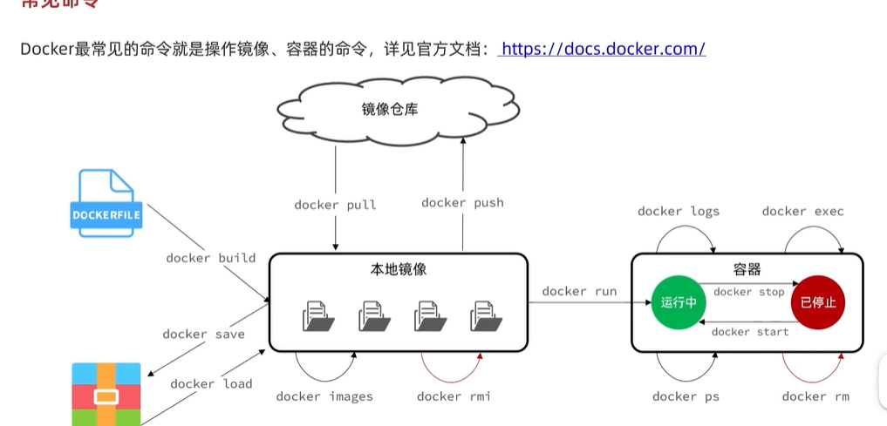
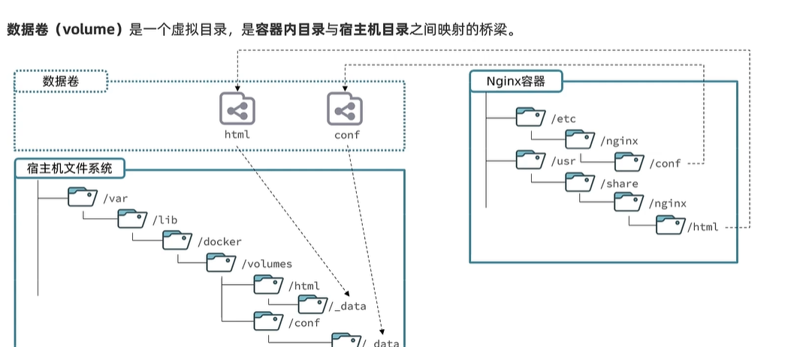

## 安装命令

```bash
docker run -d \
--name mysql
-p 3306:3306 \
-e TZ=Asia/Shanghai \
-e MYSQL_RO0T_PASSWORD=123 \
mysql
```

## 命令解读

1. docker run : 创建并运行一个容器
2. -d ：让容器在后台运行
3. --name mysql： 给容器取一个名字，必须唯一，方便区分
4. -p 3306: 3306：设置端口映射，**第一个端口是宿主机端口，第二个端口是容器内**服务的端口
   1. 由于外界无法直接访问容器内，所以做了端口映射
   2. 外界直接访问宿主机 + 端口，然后经过端口映射，访问容器内的服务
5. -e KEY=VALUE: 是设置环境变量，不同镜像的key和value 由镜像决定
   1. 可以查看hub.docker.com镜像官网，查看他们的镜像说明
6. mysql：指定运行的镜像的名字
   1. 镜像名规范
      1. `[镜像名称][版本]`
      2. 如：mysql:5.7

## 常见命令

[官方文档](https://docs.docker.com)



1. docker pull 将镜像从远端拉取到本地
2. docker images： 查看本地所有的镜像列表
3. docker rmi： 删除镜像
4. docker build : 将自己的镜像，打包成镜像文件
5. docker save： 将本地的镜像文件，打包成压缩包
6. docker load： 将压缩包，加载到本地镜像列表
7. docker push： 将镜像推送到镜像仓库
8. docker run ： 创建并运行容器
9. docker start：运行容器
10. docker stop + 容器名： 停止容器
11. docker ps ： 查看当前容器的运行状态
12. docker ps -a: 查看所有容器(包含运行中、 已停止的容器)
13. docker logs： 查看运行的日志
14. docker exec： 通过这个命令进入容器，然后在容器里进行一些操作

## 命令的别名

1. 进入别名文件

   ```bash
   vi ~/.bashrc
   ```

2. ```bash
   bashrc
   # User specific aliases and functions
   alias rm='rm -i'
   alias cp='cp -i'
   alias mv='mv -i'
   alias dps='docker ps --format "table {{.ID}}\t{{. Image}}\t{{.Ports}}\t{{.Status}}\t{{.Names}}"'
   alias dis = 'docker imgages'
   # Source global definitions
   if [ -f /etc/bashrc ]; then
   		. /etc/bashrc
   fi
   
   ```

3. 使命令生效

   ```bash
   source vi ~/.bashrc
   ```

## 数据卷挂载

数据卷：是一个虚拟的目录，是`容器内目录`与`宿主机目录`之间映射的桥梁

映射好之后，就会在宿主机的var/lib/docker/volumes/ 文件夹下找到对应的文件

常用命令：

```bash
docker run -d --name nginx -p 80:80 -v html:/user/share/nginx/html nginx
```

1. docker run： 创建容器
2. -d： 让容器在后台运行
3. --name： 给容器取名
4. -p： 设置端口映射，宿主机：容器端口
5. -v 设置数据卷
   1. 第一个参数是宿主机目录，默认是放在var/lib/docker/volumes下
   2. 冒号后，要根据nginx的官方文档来写，看看具体的目录在哪



| 命令                  | 说明                 |      |
| --------------------- | -------------------- | ---- |
| docker volume create  | 创建数据卷           |      |
| docker volume ls      | 查看所有数据卷       |      |
| docker volumn rm      | 删除指定数据卷       |      |
| docker volumn inspect | 查看某个数据卷的详情 |      |
| docker volumn prune   | 清除数据卷           |      |

1. 在执行docker run命令时，使用`-v 数据卷:容器内目录` 可以完成数据卷挂载
2. 当创建容器时，如果挂载了数据卷，且数据卷不存在，会自动创建数据卷
3. **挂载要在容器创建的时候执行**，**如果容器已经创建，是无法挂载的**